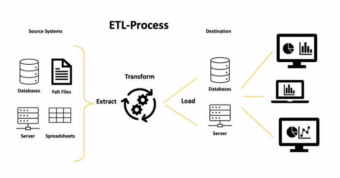
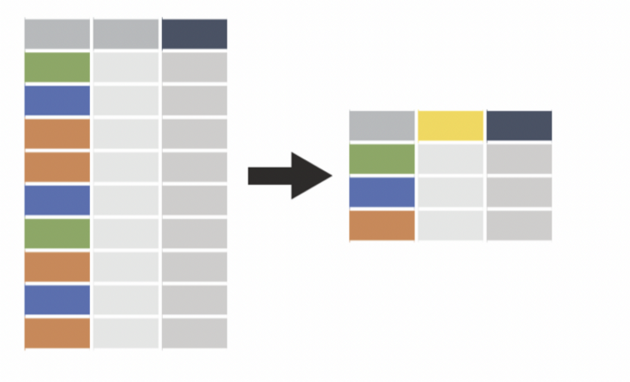
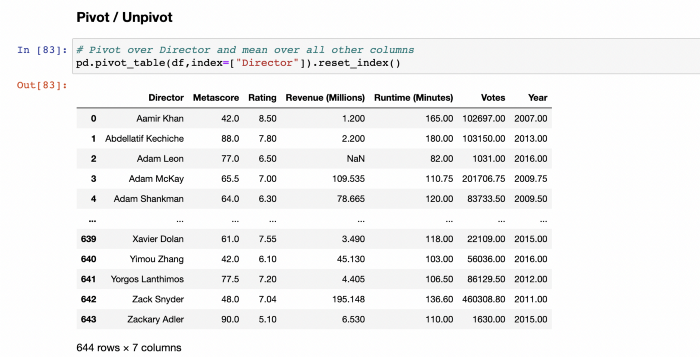
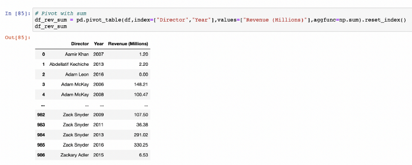
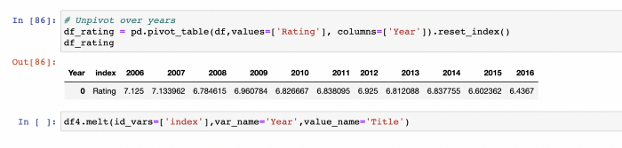
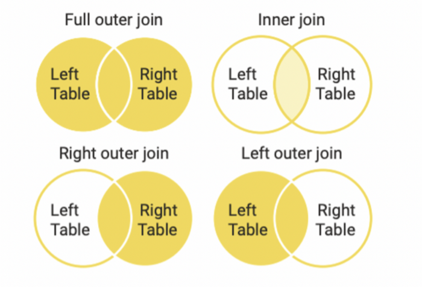
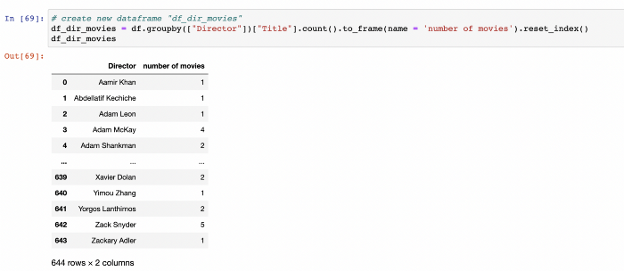
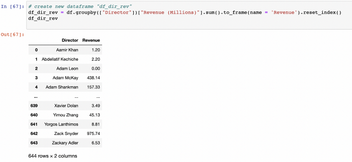
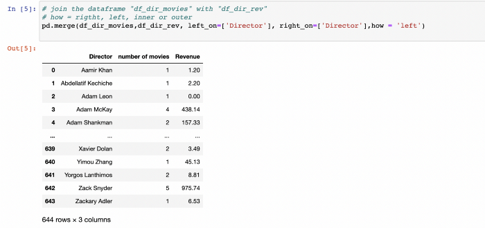

# Jupyter Pandas Cheat Sheet

## ETL-Process
ETL (extract, transform, load) is a type of data integration that refers to the three phases (extract, transform, and load) that are used to combine data from various sources. Data is extracted from one or different source systems, transformed into an analyzeable format, and loaded into a data warehouse or other system throughout this process.

The ETL process consists of three main basic components:
Input -> Transform -> Output

The task of the Input is to load different data source types into the processing tool.
At the Output, the processed data is exported back to other databases, systems, or files.
The Transformation process, on the other hand, can be divided into further sub-processes, which essentially consist of the following components:
* Filtering columns or rows
* Transforming columns or rows with mathematical or text functions
* Aggregate and reshape (groupby and pivoting)
* Combining (join and concatenate)

## Jupyter Pandas Cheat Sheet
### Introduction
In this section we call the two main Python packages pandas and numpy.
To refer to the functions and objects of the packages, we add the corisponding aliases pd and np at the end.
> import pandas as pd
>
> import numpy as np

Then we read the csv file "input" in the dataframe "df" and output it with "df".
Importing a csv-File input.csv in a dataframe df
> df = pd.read_csv('path_to/input.csv' ,sep=",") 
> print(df)

Finally we export the dataframe "df" as csv file with the name "output.csv".
> df.to_csv ('path_to/output.csv' , index = False, header=True) 

### Exploring Data
It is always good to get a quick insight about the data. 

Various commands are available to show the data in the dataframe "df" from different angles.

> df.head()       # first five rows

> df.tail()       # last five rows

> df.sample(5)    # random sample of rows

> df.shape        # number of rows/columns 

> df.describe()   # calculates measures of central tendency

> df.info()       # memory footprint and datatypes

### Statistics
The following commands cover the most common statistics functions:
> df.describe() # Summary statistics for numerical columns

> df.mean() # Returns the mean of all columns

> df.corr() # Returns the correlation between columns in a DataFrame

> df.count() # Returns the number of non-null values in each DataFrame column

> df.max()  # Returns the highest value in each column

> df.min() # Returns the lowest value in each column

> df.median() # Returns the median of each column

> df.std() # Returns the standard deviation of each column

### Import Data from Files
In the most cases you want to import data from a csv file or an Excel file.
The name of the csv file is definied by my-data.csv. Rename the file to your needs. The same applies to the import of Excel files.

#### Import csv
> df = pd.read_csv('Data/my-data.csv' ,sep=",") 

#### Import xls
> df = pd.read_excel('Data/my-data.xlsx')
>
> df = pd.read_excel('Data/my-data.xlsx',
>     sheetname='sheet1',
>     skiprows=[1] # header data
> )

If you want to import a specific Excel sheet, rename "sheet1" with the desired sheet-name. You may also skip the first x rows with skiprows=[1]. Change "1" with the desired number of rows.

### Export Data to files
The data in a dataframe can be easily exported to an Excel file or a csv file.

#### Export xls
> df.to_excel('Data/my-data.xlsx')

#### Export csv
> df.to_csv ('Data/my-data.csv' , index = False, header=True) 

### Column manipulation
Dataframes can be modified by manipulating columns in different ways.
The following codes show how to filter the desired columns or how to rename them
#### Column Filter
> df[['Title','Rating']]

> df.filter(['Title','Rating'])

#### Column Rename
> df.rename(columns={'Title': 'a', 'Rating': 'c'},inplace=True)

Rename the columns back
> df.rename(columns={'a': 'Title', 'c': 'Rating'},inplace=True)

#### Column Resorter/Reorder
> df.columns.values # show column values

Reorder Rating after Title
> df[['Title', 'Rating','Genre', 'Description', 'Director', 'Actors', 'Year',
>        'Runtime (Minutes)',  'Votes', 'Revenue (Millions)',
>        'Metascore']]

Constant Value Column
> df['new_column'] = 23
> df.head()

Math Formula
> df['Rating_Votes'] = df.Rating + df.Votes
> df[['Rating_Votes','Rating','Votes']].head()

Changing the type of a column from integer to string is a common task in data engineering. With "astype" you can change from number to string, from string to number or from number to double:

Number to String
> df['Year_str'] =df['Year'].astype(str)
> df.info()

String to Number
> df['Year_int'] =df['Year_str'].astype(int)
> df.info()

Double to Int
> df['Rating_int'] = df['Rating'].round(0).astype(int)
> df[['Rating_int','Rating']].head()

To change string values in a column, several commands are available. Common tasks include changing string values to upper or lower case, counting word length, or finding the beginning of a word.

String Replacer
> df['Title'].replace('Prometheus', 'Alien') 
> df[df.Title == 'Prometheus']

##### String Manipulation
Lower cases
> df['Title2'] = df['Title'].str.lower()
> df[['Title2','Title']].head()

Upper cases
> df['Title2'] = df['Title'].str.upper() 
> df[['Title2','Title']].head()

Length of words
> df['Title2'] = df['Title'].str.len() 
> df[['Title2','Title']].head()

First word
> df['Title2'] = df['Title'].str.split(' ').str[0]
> df[['Title2','Title']].head()

Find the word "Squad" in Title
> df['Title2'] = df['Title'].str.find('Squad', 0) 
> df[['Title2','Title']].head()

Without going into the many possibilities of date manipulation here, we will refer only to the conversion of string values into date values, as this is one of the most common tasks.

Date manipulation
> pd.to_datetime('2010/11/12')

Sorting of a column is possible by one or more values at the same time.

Sort
> df.sort_values(by='Title', ascending=True)
> df.sort_values(by=['Director','Year'], ascending=True)

#### Row manipulation
As for the manipulation of columns, there are certain basic tasks to be done for the manipulation of rows.
Filtering rows can be done in different way. The following image shows how you can filter rows by their content. Normally you want to filter by name or by range of values.

##### Row Filter
Select Title 'Prometheus'
> df[df.Title == 'Prometheus']

Select Rating greater or equal 8.5
> df[df.Rating >= 8.5]

Select Year equal 2016 and Rating greater or equal 8.5
> df[(df.Year == 2016) & (df.Rating >= 8.5)]

Select Title with 'Prometheus','Sing', 'Guardians of the Galaxy'
> titel = ['Prometheus','Sing', 'Guardians of the Galaxy']
> df[df.Title.isin(titel)]

Select years in 2010,2015,002
> years = [2010,2015,2002]
> df[df.Year.isin(years)]

Selects rows 1-to-3
> df.iloc[0:3]

First 4 rows and first 2 columns
> df.iloc[0:4, 0:2]

#### Table Manipulation
##### Group By
The Group By statement groups rows that have the same values into summary rows, like "find the number of titles for each year".

The Group By statement is often used with aggregate functions (COUNT(), MAX(), MIN(), SUM(), AVG()) to group the result-set by one or more columns. Here are a few examples:

Number of titles per year
> df.groupby("Year")["Title"].count().to_frame() 

Number of titles per year and per director
> df.groupby(["Year","Director"])["Title"].count().to_frame().reset_index()

Number of titles per director
> df.groupby(["Director"])["Title"].count().to_frame(name = 'count').reset_index() 

Total revenue per year and per director
> df.groupby(["Year","Director"])["Revenue (Millions)"].sum().to_frame().reset_index()

Rating-Mean per director
> df.groupby("Director")["Rating"].mean().to_frame().reset_index()

Combination of different group by functions
> df.groupby(["Year","Director"]).agg(
>     {
>          'Title':"count",  # number of titles per year and director
>          'Rating':"mean",  # Rating-Mean per director
>          'Revenue (Millions)': "sum"  # Total revenue per year and director
>     }
> ).reset_index() 

##### Pivot / Unpivot
Pivot tables in Excel are probably familiar to most people. Pandas provides a similar function called pivot_table.

The following example shows how the pivot function over the "Director" column summarizes all other columns as mean values.

Pivot over Director and mean over all other columns
> pd.pivot_table(df,index=["Director"]).reset_index()

If you want to summarize explicitly using sums, you must add the parameter "aggfunc=sum".

Pivot with sum
> df_rev_sum = pd.pivot_table(df,index=["Director","Year"],values=["Revenue (Millions)"],aggfunc=np.sum).reset_index()
> df_rev_sum

Another possibility, similar to the transpose function in Excel, is to unpivot the data. Here we unpivot the years over the rating and for each year a column with the mean value of the rating is displayed.

Unpivot over years
> df_rating = pd.pivot_table(df,values=['Rating'], columns=['Year']).reset_index()
> df_rating

> df4.melt(id_vars=['index'],var_name='Year',value_name='Title')

##### Join
The join function is one of the most important operation in data engineering.
Understanding the following concept in the figure below is crucial to applying the join function.

Visual programming tools are better suited for this process. However, since we want to do this in Jupyter-Notebook, we will first create two data frames.
We create first a dataframe with all movie directors and the number of their movies.

Create new dataframe "df_dir_movies"
> df_dir_movies = df.groupby(["Director"])["Title"].count().to_frame(name = 'number of movies').reset_index()
> df_dir_movies

Then we create the second data frame with the directors and the total revenue generated for all their movies.

Create new dataframe "df_dir_rev"
> df_dir_rev = df.groupby(["Director"])["Revenue (Millions)"].sum().to_frame(name = 'Revenue').reset_index()
> df_dir_rev

Now we join the two data frames together using the "director" column.
There is an option to make the following joins using the "how" parameter:
- left
- right
- inner
- outer
The resulting dataframe shows the directors with their number of movies and the total generated revenues in a table.

Join the dataframe "df_dir_movies" with "df_dir_rev"

how = rigtht, left, inner or outer

> pd.merge(df_dir_movies,df_dir_rev, left_on=['Director'], right_on=['Director'],how = 'left') 

##### Concatenate
Combining or appending two different dataframes can be done with the following two functions. It is important that the columns in both data frames are the same.

> df2 = df
> df.append(df2) # Append df2 to df (The columns must be the same in both dataframes)
> pd.concat([df, df2],axis=0) # concatenate two dataframes

### Import Data from Databases
#### Import from mysql
> import pymysql
>
> conn = pymysql.connect(host='localhost',port=3306, db='database',user='root',password='pw')
> 
> df = pd.read_sql_query(
> "SELECT * FROM table LIMIT 3;",
>     conn)
> df.tail(100)

#### Import Teradata
> import teradata

Make a connection
> session = udaExec.connect(method="odbc",
>                           USEREGIONALSETTINGS="N",
>                           system= "dwh",
>                           username = "root",
>                           password = "pw");  
>
> query = "SELECT * FROM DATABASEX.TABLENAMEX"

Reading query to df
> df = pd.read_sql(query,session)

Do something with df,e.g.
> print(df.head()) #to see the first 5 rows

#### Import SAP-Hana
> import pyhdb
>  
> connection = pyhdb.connect(
>     host="localhost",
>     port=30015,
>     user="root,
>     password="pw"
> )
> print(connection.isconnected())
> query = "SELECT * FROM HDB_REPORT.\"Table\""
> df = pd.read_sql(query,connection)
 
Do something with df,e.g.
> print(df.head()) #to see the first 5 rows

## Conclusion
With this Cheat Sheet you should be well prepared to perform most of the Data Enginnering tasks with Pandas in Jupyter-Notebook.
This will also make it easier to integrate code you write in Python into KNIME and benefit from the advantages of both worlds.
